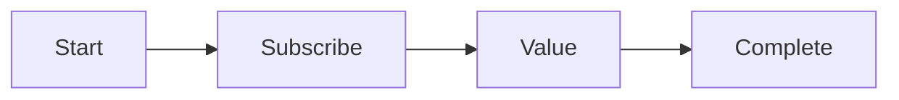
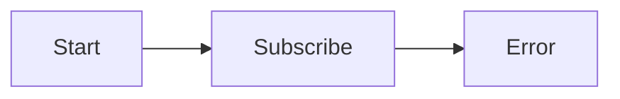
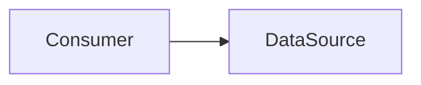
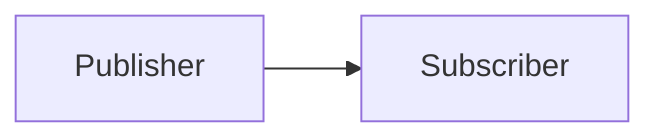
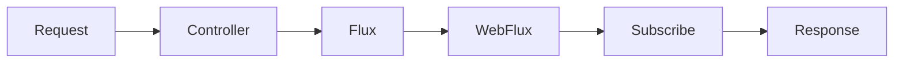
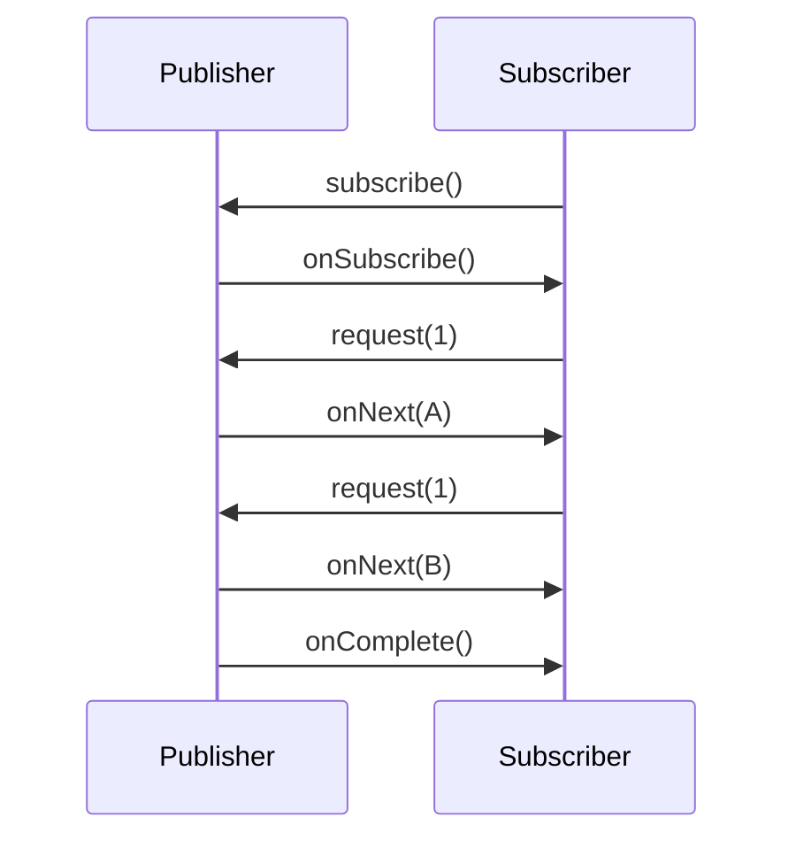
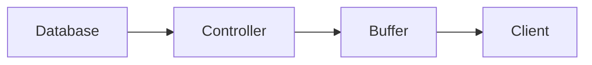
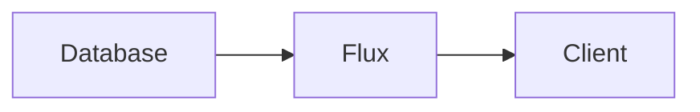

# Reactor Flux and Mono Demo

## Introduction

Project Reactor is the reactive programming foundation used by Spring WebFlux. It implements the Reactive Streams specification and provides two primary publisher types:

- `Mono<T>` → Represents 0 or 1 element
- `Flux<T>` → Represents 0 to N elements

Both are lazy, asynchronous, and non-blocking by design.

---

## Reactive Streams Basics

Reactive Streams defines four main components:


### Publisher

Produces data.

### Subscriber

Consumes data.

### Subscription

Represents the connection between publisher and subscriber and controls demand.

### Processor

Acts as both a Subscriber and Publisher.

---

# Mono

A `Mono<T>` represents:

- No value
- Exactly one value
- An error

Examples:

```java
Mono<String> mono = Mono.just("Hello");
```

```java
Mono<String> mono = Mono.empty();
```

```java
Mono<String> mono = Mono.error(
        new RuntimeException("Boom")
);
```

---

## Mono Lifecycle



Or:



---

## Creating Mono

### just()

```java
Mono<String> mono = Mono.just("Hello");
```

### empty()

```java
Mono<String> mono = Mono.empty();
```

### error()

```java
Mono<String> mono =
        Mono.error(new RuntimeException());
```

### fromCallable()

Lazy execution.

```java
Mono<String> mono =
        Mono.fromCallable(() -> {
            System.out.println("Executing");
            return "Hello";
        });
```

Nothing executes until subscription.

### defer()

Creates a fresh Mono per subscription.

```java
Mono<String> mono =
        Mono.defer(() ->
                Mono.just(UUID.randomUUID().toString()));
```

---

# Flux

A `Flux<T>` represents:

- Zero values
- One value
- Many values
- Infinite values
- An error

Example:

```java
Flux<String> flux =
        Flux.just("A", "B", "C");
```

---

# Flux vs List

## List

```java
List<String> list =
        List.of("A", "B", "C");
```

Characteristics:

- Eager
- Already in memory
- Finite
- No backpressure
- Synchronous

---

## Flux

```java
Flux<String> flux =
        Flux.just("A", "B", "C");
```

Characteristics:

- Lazy
- Can be asynchronous
- Can be infinite
- Supports backpressure
- Produced on demand

---

## Comparison

| Feature | List | Flux |
|----------|----------|----------|
| Lazy | No | Yes |
| Infinite | No | Yes |
| Async | No | Yes |
| Backpressure | No | Yes |
| Streaming | No | Yes |
| Non-blocking | No | Yes |

---

---

# Java Stream vs Flux

At first glance, Java Streams and Reactor Flux look very similar because they share many operators:

```java
map()
filter()
flatMap()
reduce()
```

However, they solve fundamentally different problems.

## Quick Comparison

| Feature | Java Stream | Flux |
|----------|-------------|------|
| Purpose | Collection processing | Asynchronous event streams |
| Lazy | Yes | Yes |
| Async | No | Yes |
| Infinite Streams | Limited | Native support |
| Backpressure | No | Yes |
| Reactive Streams Compliant | No | Yes |
| Streaming over network | No | Yes |
| Push-based | No | Yes |
| Time-aware | No | Yes |

---

## Java Stream

Think:

```text
Data already exists
        ↓
Process it
        ↓
Get result
```

Example:

```java
List<String> names =
        List.of("john", "alice", "bob");

names.stream()
     .map(String::toUpperCase)
     .forEach(System.out::println);
```

Output:

```text
JOHN
ALICE
BOB
```

The entire dataset already exists in memory.

---

## Flux

Think:

```text
Data may not exist yet
Data may arrive later
Data may never stop
```

Example:

```java
Flux.interval(Duration.ofSeconds(1))
    .subscribe(System.out::println);
```

Output:

```text
0
1
2
3
...
```

Values are generated over time.

---

## Pull vs Push

This is one of the most important differences.

### Java Stream = Pull Model



The consumer keeps pulling data from the source.

Conceptually similar to:

```java
iterator.next();
```

The next element is only produced when requested.

---

### Flux = Push Model



The publisher pushes data toward subscribers whenever it becomes available.

Example:

```java
Flux.interval(Duration.ofSeconds(1))
```

Every second:

```text
Publisher:
"Here's the next value."
```

---

## Existing Data vs Future Data

### Java Stream

Works on data that already exists.

```java
List<User> users =
        repository.findAll();

users.stream()
     .map(User::getName)
     .forEach(System.out::println);
```

All users are already loaded into memory.

---

### Flux

Works on data that may arrive in the future.

```java
Flux<User> users =
        repository.findAll();
```

No user has necessarily been fetched yet.

The query may not execute until subscription.

---

## Infinite Streams

### Java Stream

Possible, but not common.

```java
Stream.iterate(0, i -> i + 1)
      .limit(5)
      .forEach(System.out::println);
```

Output:

```text
0
1
2
3
4
```

Usually requires a terminating operation.

---

### Flux

Infinite streams are a first-class concept.

```java
Flux.interval(Duration.ofSeconds(1));
```

Can run forever.

---

## Asynchronous Processing

### Java Stream

```java
Stream.of(1, 2, 3)
      .map(i -> {
          Thread.sleep(1000);
          return i;
      });
```

Blocks the current thread.

---

### Flux

```java
Flux.range(1, 3)
    .flatMap(i ->
            Mono.fromCallable(() -> {
                Thread.sleep(1000);
                return i;
            })
            .subscribeOn(
                    Schedulers.boundedElastic()
            )
    );
```

Can execute asynchronously without blocking the caller thread.

---

## Error Handling

### Java Stream

Errors terminate processing.

```java
stream.map(v -> {
    throw new RuntimeException();
});
```

---

### Flux

Errors are part of the stream lifecycle.

```java
Flux.just(1, 2, 3)
    .map(i -> {
        throw new RuntimeException();
    })
    .onErrorReturn(-1);
```

Output:

```text
-1
```

---

## Backpressure

### Java Stream

No backpressure protocol exists.

The producer and consumer run at the same pace.

---

### Flux

Subscriber controls demand.

```java
request(5);
```

Meaning:

```text
Give me only 5 items.
```

The publisher must obey.

---

## Streaming HTTP Responses

Java Streams were not designed for network streaming.

```java
@GetMapping("/users")
public Stream<User> users()
```

Most frameworks will still collect all results before responding.

---

Flux supports true streaming.

```java
@GetMapping(
        produces =
        MediaType.TEXT_EVENT_STREAM_VALUE
)
public Flux<User> users()
```

Each value can be sent to the client immediately as it arrives.

---

## flatMap Difference

### Java Stream

```java
Stream.of(1, 2)
      .flatMap(i ->
              Stream.of(i, i * 10)
      )
      .forEach(System.out::println);
```

Output:

```text
1
10
2
20
```

Used primarily for flattening collections.

---

### Flux

```java
Flux.just(1, 2)
    .flatMap(i ->
            Mono.delay(
                    Duration.ofSeconds(i)
            )
            .thenReturn(i)
    );
```

Used for flattening asynchronous publishers and enabling concurrency.

---

## Mental Models

### Java Stream

```text
I already have all the data.
Now process it.
```

---

### Flux

```text
Data will arrive eventually.
Describe what should happen when it arrives.
```

---

## Rule of Thumb

```text
Java Stream = Collection Processing

Flux = Event Stream Processing
```

Or even simpler:

```text
Stream = Data that exists

Flux = Data that happens
```

---

# Creating Flux

## just()

```java
Flux.just("A", "B", "C");
```

---

## fromIterable()

```java
Flux.fromIterable(
        List.of("A", "B", "C")
);
```

---

## fromStream()

```java
Flux.fromStream(
        Stream.of("A", "B", "C")
);
```

---

## range()

```java
Flux.range(1, 5);
```

Output:

```text
1
2
3
4
5
```

---

## empty()

```java
Flux.empty();
```

---

## error()

```java
Flux.error(
        new RuntimeException("Boom")
);
```

---

## interval()

Produces values periodically.

```java
Flux.interval(
        Duration.ofSeconds(1)
);
```

Output:

```text
0
1
2
3
...
```

Infinite stream.

---

## generate()

Synchronous generation.

```java
Flux.generate(
        () -> 0,
        (state, sink) -> {

            sink.next(state);

            return state + 1;
        }
)
.take(5);
```

Output:

```text
0
1
2
3
4
```

---

## create()

Manual asynchronous push source.

```java
Flux.create(sink -> {

    sink.next("A");
    sink.next("B");

    sink.complete();

});
```

Example with another thread:

```java
Flux.create(sink -> {

    new Thread(() -> {

        int i = 0;

        while (true) {

            sink.next(i++);

            try {
                Thread.sleep(1000);
            } catch (Exception e) {
                sink.error(e);
            }
        }

    }).start();

});
```

Useful for adapting callback APIs.

---

# Mono and Flux Operators

---

## map()

Transforms one value into another.

```java
Flux.just("john", "alice")
    .map(String::toUpperCase)
    .subscribe(System.out::println);
```

Output:

```text
JOHN
ALICE
```

---

## filter()

```java
Flux.range(1, 10)
    .filter(i -> i % 2 == 0)
    .subscribe(System.out::println);
```

Output:

```text
2
4
6
8
10
```

---

## flatMap()

One element can become many elements.

```java
Flux.just(1, 2, 3)
    .flatMap(i -> Flux.range(i, 2))
    .subscribe(System.out::println);
```

Possible output:

```text
1
2
2
3
3
4
```

Order is not guaranteed.

---

## concatMap()

Ordered version of flatMap.

```java
Flux.just(1, 2, 3)
    .concatMap(i -> Flux.range(i, 2))
    .subscribe(System.out::println);
```

Output:

```text
1
2
2
3
3
4
```

Order guaranteed.

---

## take()

```java
Flux.range(1, 100)
    .take(5);
```

Output:

```text
1
2
3
4
5
```

---

## skip()

```java
Flux.range(1, 10)
    .skip(5);
```

Output:

```text
6
7
8
9
10
```

---

## distinct()

```java
Flux.just(
        1,1,2,2,3,3
)
.distinct();
```

Output:

```text
1
2
3
```

---

## collectList()

Convert Flux into Mono<List<T>>

```java
Flux.just("A", "B", "C")
    .collectList();
```

Returns:

```java
Mono<List<String>>
```

---

## reduce()

```java
Flux.range(1, 5)
    .reduce(Integer::sum);
```

Output:

```text
15
```

---

## count()

```java
Flux.range(1, 10)
    .count();
```

Returns:

```java
Mono<Long>
```

---

## merge()

Subscribes to all publishers immediately.

```java
Flux.merge(
        flux1,
        flux2
);
```

### Infinite Streams

```java
Flux.merge(
        Flux.interval(Duration.ofSeconds(1)),
        Flux.interval(Duration.ofSeconds(2))
);
```

Both streams emit forever.

---

## concat()

Subscribes to the next publisher only after the previous completes.

```java
Flux.concat(
        flux1,
        flux2
);
```

### Infinite Streams

```java
Flux.concat(
        Flux.interval(Duration.ofSeconds(1)),
        Flux.interval(Duration.ofSeconds(1))
);
```

Second stream never starts because the first stream never completes.

---

## zip()

Pairs values together.

```java
Flux.zip(
        Flux.just("A", "B"),
        Flux.just(1, 2)
);
```

Output:

```text
(A,1)
(B,2)
```

---

## combineLatest()

Emits whenever any source changes.

```java
Flux.combineLatest(
        flux1,
        flux2,
        (a,b) -> a + "-" + b
);
```

---

# Subscribing

Nothing happens until someone subscribes.

Reactive pipelines are lazy.

---

## Example

```java
Mono<String> mono =
        Mono.just("Hello")
            .map(String::toUpperCase);

System.out.println("Created");
```

Output:

```text
Created
```

No execution yet.

---

## Subscribe

```java
mono.subscribe(
        System.out::println
);
```

Output:

```text
HELLO
```

---

## Subscribe Variants

### Success Consumer

```java
mono.subscribe(
        System.out::println
);
```

---

### Success + Error

```java
mono.subscribe(
        System.out::println,
        Throwable::printStackTrace
);
```

---

### Success + Error + Complete

```java
flux.subscribe(
        System.out::println,
        Throwable::printStackTrace,
        () -> System.out.println("Done")
);
```

---

# Disposable

subscribe() returns a Disposable.

```java
Disposable disposable =
        Flux.interval(
                Duration.ofSeconds(1)
        )
        .subscribe(System.out::println);
```

---

## Cancel Subscription

```java
disposable.dispose();
```

Equivalent to cancelling the subscription.

---

## Check State

```java
disposable.isDisposed();
```

---

# Why We Rarely Subscribe Manually

In Spring WebFlux:

```java
@GetMapping("/users")
public Flux<User> getUsers() {

    return service.getUsers();

}
```

You do NOT do:

```java
service.getUsers()
       .subscribe();
```

Instead:



Spring WebFlux automatically subscribes.

It also handles cancellation when the client disconnects.

---

# Full Subscriber

Subscriber gives complete control.

```java
Flux.just("A", "B")
    .subscribe(
        new BaseSubscriber<>() {

            @Override
            protected void hookOnSubscribe(
                    Subscription subscription) {

                request(1);
            }

            @Override
            protected void hookOnNext(
                    String value) {

                System.out.println(value);

                request(1);
            }

        }
    );
```

---

## Lifecycle



---

# BaseSubscriber Hooks

## hookOnSubscribe()

```java
protected void hookOnSubscribe(
        Subscription subscription)
```

Called once.

---

## hookOnNext()

```java
protected void hookOnNext(T value)
```

Called for every value.

---

## hookOnComplete()

```java
protected void hookOnComplete()
```

Called on successful completion.

---

## hookOnError()

```java
protected void hookOnError(
        Throwable throwable)
```

Called on failure.

---

## hookOnCancel()

```java
protected void hookOnCancel()
```

Called when cancelled.

---

## cancel()

```java
cancel();
```

Stops receiving values.

---

# Backpressure

Subscriber controls demand.

```java
request(n);
```

Example:

```java
Flux.range(1, 100)
    .subscribe(
        new BaseSubscriber<>() {

            @Override
            protected void hookOnSubscribe(
                    Subscription subscription) {

                request(5);
            }

        }
    );
```

Only five values are delivered.

---

# Streaming

Traditional MVC waits for all data.



Entire response is built first.

---

## WebFlux Streaming



Values are sent as they arrive.

---

# Streaming Endpoint

```java
@GetMapping(
        value = "/stream",
        produces = MediaType.TEXT_EVENT_STREAM_VALUE
)
public Flux<Long> stream() {

    return Flux.interval(
            Duration.ofSeconds(1)
    );

}
```

Output:

```text
data: 0

data: 1

data: 2

data: 3
```

---

# Server Sent Events (SSE)

```java
@GetMapping(
        value = "/events",
        produces = MediaType.TEXT_EVENT_STREAM_VALUE
)
public Flux<String> events() {

    return Flux.interval(
                    Duration.ofSeconds(1)
            )
            .map(i -> "Event " + i);

}
```

---

# Cold vs Hot Publishers

## Cold Publisher

Every subscriber gets the full sequence.

```java
Flux<Integer> flux =
        Flux.range(1, 3);

flux.subscribe(System.out::println);
flux.subscribe(System.out::println);
```

Output:

```text
1
2
3

1
2
3
```

---

## Hot Publisher

Shared stream.

```java
Flux<Long> hot =
        Flux.interval(
                Duration.ofSeconds(1)
        )
        .share();
```

Late subscribers miss old values.

---

# Summary

## Mono

- 0 or 1 value
- Lazy
- Async capable
- Common for single resource lookups

## Flux

- 0 to N values
- Can be infinite
- Supports streaming
- Supports backpressure

## Key Concepts

- Lazy execution
- Subscription-driven execution
- Backpressure
- Streaming responses
- Automatic subscription by WebFlux
- Cancellation support
- Cold and hot publishers
- Reactive Streams compliance

## Most Important Rule

Nothing happens until somebody subscribes.